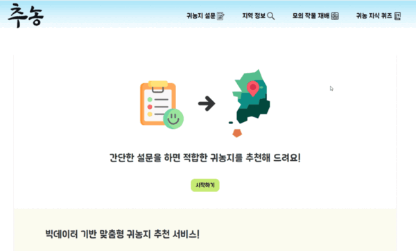
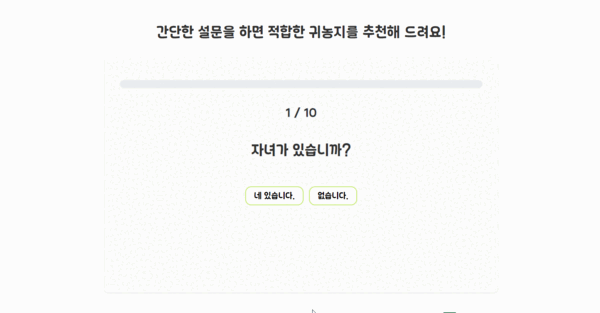
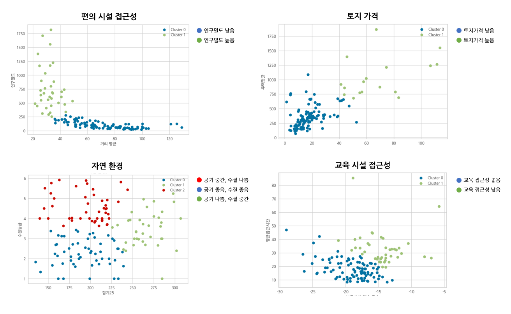
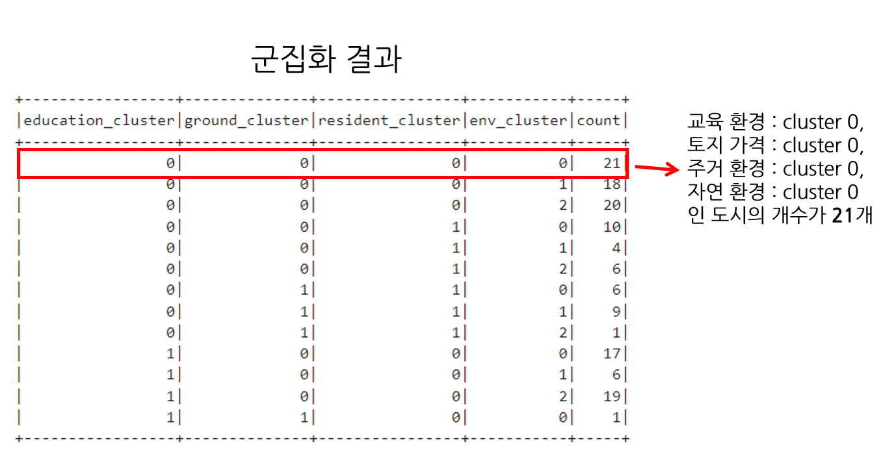
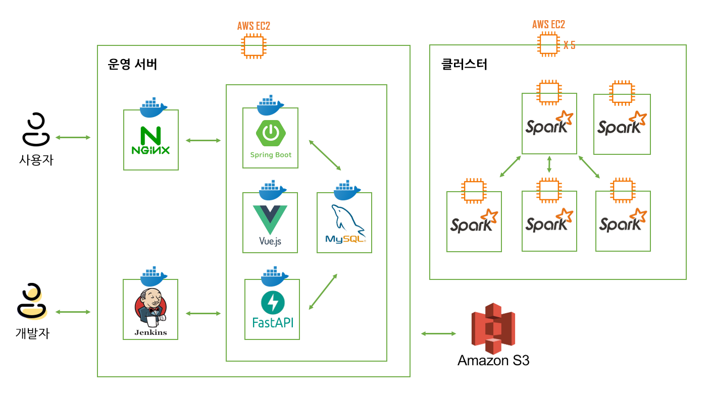

# 추농

## 기획 배경
최근 몇 년간 귀농에 대한 관심이 많아지고 있습니다. 하지만 귀농 후보 지역이 매우 많아 귀농지를 결정하기가 쉽지 않으며 많은 조사가 필요합니다. 실제로 평균 귀농 준비 기간은 2년 이상이고, 그 중에서 70%의 시간을 귀농지를 찾는데 사용합니다.   

그래서 저희는 귀농지 맞춤 추천으로 고민은 줄이고, 모의 작물 재배로 수익률은 높이는 귀농지 추천 서비스 "추농"을 기획하게 되었습니다.

 

## 주요 기능

1. 귀농지 추천 : 사용자로부터 간단한 설문을 받고 귀농지를 추천합니다. 귀농지를 선택할 때 많이 고려하는 기준을 중심으로 설문 문항을 작성했으며 내부적으로 k-means와 아이템 기반 협업 필터링을 사용해 지역을 추천합니다.
2. 모의 작물 재배 : 2022년 농산물 소득자료집에 기반해 재배 작물의 예상 수익, 경영비를 그래프로 시각화하여 보여줍니다.

 

## 주요 화면

### 메인 화면

- 추농 서비스의 메인 화면입니다. 메인 화면에서 설문, 모의 작물 재배를 진행할 수 있습니다.

### 귀농 설문

- 사용자는 총 10개 문항의 설문을 진행합니다.
- 설문이 완료되면 추농 서비스는 사용자에 맞는 상위 5개 지역을 추천합니다.

### 귀농지 상세 정보

- 추천 받은 귀농지의 상세 정보를 확인합니다.
- 귀농지 지역 정보, 많이 키우는 작물, 귀농 정책, 지도를 확인할 수 있습니다.

### 모의 작물 재배

- 토지 면적, 재배 작물, 작물 재배 비율을 입력합니다. 
- 2022년 농산물 소득자료집에 기반해 재배 작물의 예상 수익, 경영비를 그래프로 시각화하여 보여줍니다.

### 귀농 지역 통계

- 데이터셋에 기반하여 귀농인이 많은 지역, 전년대비 많아진 지역을 추천합니다.

## 기술 특장점

### 귀농 지역 추천

사용자가 "아이가 있습니까?"라는 설문에 "네 있습니다."라고 답하면 교육 접근성이 높은 곳을 추천합니다. 다른 설문 항목에 대해서도 똑같이 동작되어 귀농지를 추천합니다. 이 추천 기능을 아래와 같이 구현했습니다.

귀농지를 선택할 때 많이 고려하는 기준 4개(토지 가격, 자연 환경, 편의 시설, 교육 환경)를 선정합니다. 그리고 각 기준 별로 클러스터링을 수행했습니다.

그러면 지역은 토지 가격 클러스터, 자연 환경 클러스터, 편의 시설 클러스터, 교육 환경 군집에 포함됩니다.

이때 군집의 모든 지역을 추천하면 너무 많은 지역이 추천되며 다양한 사용자의 기호를 반영하지 못합니다. 그래서 지역을 벡터화하고 유사도를 계산해 순위를 매깁니다. 그리고 상위 5개 지역을 추천합니다.

정리해면 아래와 같이 진행됩니다.
1. 사용자가 설문을 진행합니다.
2. 군집에 속하는 지역들이 추출됩니다.
3. 군집 지역들의 평균에 임의의 벡터를 만들고, 설문 문항에 가중치를 적용해 임의의 벡터를 이동시킵니다.
4. 임의의 벡터와 가장 유사한 5개 지역 벡터의 지역을 추천합니다.

### 분산 처리

총 120만개의 빅데이터를 다루고 반복적으로 클러스터링을 수행하면서 서버 확장을 고려하게 되었습니다. 추가 서버를 두는 스케일 아웃 방식을 채택했고 총 5대의 EC2 서버를 묶어 분산 처리 환경을 구축했습니다. 이때 빅데이터 저장을 위해 HDFS를 채택했고, 성능을 위해 인메모리 기반의 분산 처리 기술인 Spark를 채택했습니다. 이로 인해 데이터 처리 성능을 높일 수 있었습니다.

### 아키텍처

### 팀 역할

